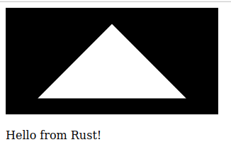

I've been using [Figma](https://www.figma.com/) more at work and have been impressed with both the application as well as its performance. One of the things to know about figma however is that while it runs completely on web standard technology, it is running as a WASM application using WebGL. On the one hand this feels a bit like the return of flash applications (but with standards!), while on the other hand I'm so completely sick of the creaking tower of abstractions that modern JavaScript has produced.

These notes are an attempt to understand the state of WASM and WebGL for building Boring Web Applications. That is, applications that are predominantly about simple user interfaces like forms, inputs, buttons, text, images, etc. For this project I'll be using Rust and the rust tooling in [wasm-pack](https://github.com/rustwasm/wasm-pack). My goal will be to build a simple web form to processes some textual input and renders the outputs, but purely running in wasm / webgl.

## What is WASM

[WebAssembly](https://webassembly.org/) or WASM is a "binary instruction format for a stack-based virtual machine [...] designed as a portable compilation target for programming languages, enabling deployment on the web". Said another way it's an intermediate bytecode format that can shipped to browsers to be run. This is notable because as an intermediate format it enables language designers to target browser development from languages beyond JavaScript. Many languages today have compilers available that will output WASM as a target some notable examples are C/C++, C#, Rust, Zig. Beyond that the ubiquity of javascript engines there's a large number of environments that have suddenly become possible WASM targets.

## What is WebGL

[WebGL](https://www.khronos.org/webgl/) a 3D graphics API based on [OpenGL ES](https://en.wikipedia.org/wiki/OpenGL_ES) itself a subset of the [OpenGL](https://en.wikipedia.org/wiki/OpenGL) graphics API designed for mobile or embedded applications. WebGL is notable because it offers a powerful, cross platform, 3D graphics target for the browser. For many targets the browser is able to use 3D acceleration and run directly on the computer's GPU which provides a much high performance graphics target than you otherwise have access to from the browser APIs. There are examples of rich 3D environments, games, and 3D accelerated applications that have shipped to browsers enabled by this technology.

## Setting up rust

```
rustup target add wasm32-unknown-unknown
cargo install -f wasm-bindgen-cli
```

## Forgetting about wasm-pack

If you search for rust and wasm you'll probably be directed to [wasm-pack](https://github.com/rustwasm/wasm-pack). I had troubles with it though. When I tried to run it I ended up in the middle of some webpack compilation error, and this is just deep in my current work trauma so I couldn't.

(notes on installing wasm-pack)

Wasm-pack ships with an [installer](https://rustwasm.github.io/wasm-pack/installer/), It's presented in the form of a `curl | sh` script, and that always makes me a bit uncomfortable. It turns out that you can just grab the tarball for your architecture from their [releases](https://github.com/rustwasm/wasm-pack/releases) page and execute the `wasm-pack` executable shipped there (this is great).

## Setting up a simple project

Without wasm-pack we need to do some stuff on our own. Luckily mostly of what wasm-pack is doing for simple projects is just running cargo and wasm-bindgen.

Cargo is pretty simple, but needs to be told to emit wasm as its target.

```bash
cargo build \
    --target wasm32-unknown-unknown
```

Once cargo build it will drop a `.wasm` file at `./target/wasm32-unknown-unknown/release/${project.name}.wasm` (where project.name is whatever the projet is configured with in Cargo.toml). At that point wasm-bindgen can take that wasm and emit a javascript file useful for loading the file as well as typescript types.

```bash
wasm-bindgen \
    --target web \
    --typescript \
    --out-dir pkg \
    --out-name index \
    ./target/wasm32-unknown-unknown/release/${project.name}.wasm
```

## How does this work?

Let's look at a really simple example. Below is an add function written in rust. It takes two unsigned 32bit integers, adds them together, and returns an unsigned 32bit integer.

```rust
pub fn add(a: u32, b: u32) -> u32 {
    a + b
}
```

When I compile this into wasm I get a pretty large binary file (15.6Kb), but I can throw it into a [disassembler](https://webassembly.github.io/wabt/demo/wasm2wat/) and dig around. Using that I found my function at the bottom of the file.

```wat
(func $add (export "add") (type $t0) (param $p0 i32) (param $p1 i32) (result i32)
  (i32.add
    (local.get $p0)
    (local.get $p1)))
```

This looks pretty reasonable! Being relatively unfamiliar with WASM I would read this as follows

```wat
(func $add ...)
```
Define a function whose value will be stored in the variable $add.

```wat
(export "add")
```
Export it as the binding "add".

```wat
(type $t0)
```
Something about types... I'm not sure

```wat
(param $p0 i32)
(param $p1 i32)
(result i32)
```
Define inputs $p0, $p1 and result of type i32

```wat
(i32.add ...)
```
Add two i32 numbers

```wat
(local.get $p0)
(local.get $p1)
```
Get $p0 and $p1 off the stack

## What about WebGL?

With wasm working, what about using WebGL? It turns out this isn't too bad (beyond the difficulties of working with OpenGL period). To get OpenGL rendering we first need a canvas with the `webgl2` context.

```rust
let canvas = document.get_element_by_id("webgl").unwrap();
let canvas: web_sys::HtmlCanvasElement = canvas.dyn_into::<web_sys::HtmlCanvasElement>()?;

let context = canvas
    .get_context("webgl2")?
    .unwrap()
    .dyn_into::<WebGl2RenderingContext>()?;
```

Once we have a webgl context we can write shaders!

```rust
    let vert_shader = compile_shader(
        &context,
        WebGl2RenderingContext::VERTEX_SHADER,
        r##"#version 300 es
 
        in vec4 position;

        void main() {
            gl_Position = position;
        }
        "##,
    )?;

    let frag_shader = compile_shader(
        &context,
        WebGl2RenderingContext::FRAGMENT_SHADER,
        r##"#version 300 es
    
        precision highp float;
        out vec4 outColor;
        
        void main() {
            outColor = vec4(1, 1, 1, 1);
        }
        "##,
    )?;
```

Annnnnd all the rest of the OpenGL stuff but I'll just link [this file](https://github.com/aconbere/simple-rust-wasm/blob/main/src/webgl.rs). It's just a lot to have all here. But stick it all together and you can draw a triangle.



## What about more complicated stuff?

I looked around at rust gui libraries that ran on OpenGL and found [egui](https://github.com/emilk/egui). Egui even ships with [examples](https://github.com/emilk/egui/tree/master/examples/custom_3d_three-d) compiling and running on webgl. With that in hand, and some minor adjustments to get it running in the scaffolding I'd already set up, I managed to have the egui 3D triangle example running in my web browser.


## Conclussions

Well, some minor hiccups along the way, but honestly this works pretty well. I want to spend some time writing some more complex guis and checking out performance. It seems like, maybe an interesting way to write rich web apps, without the current pain of writing web apps.
