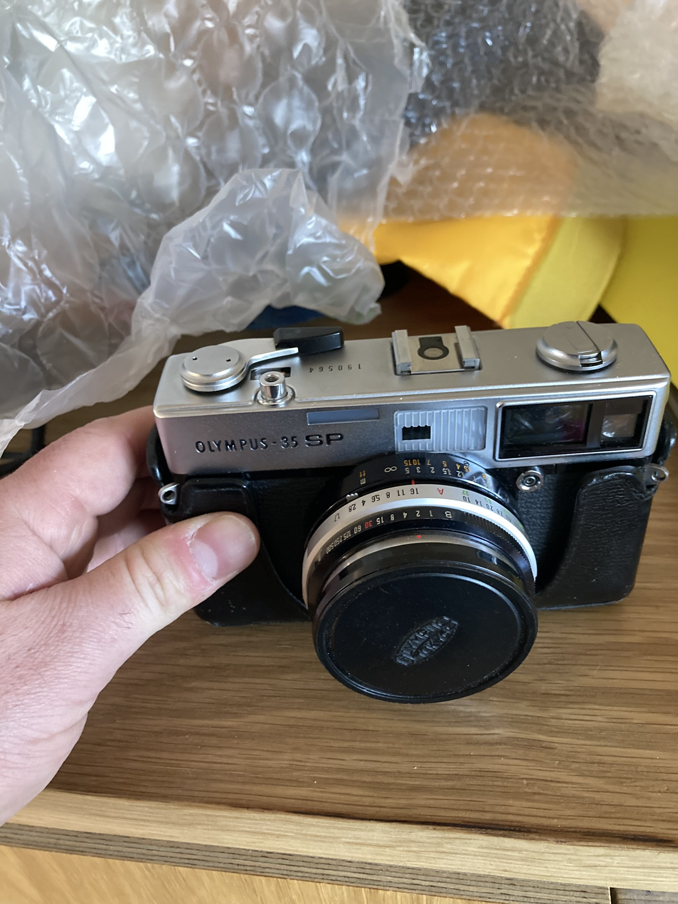
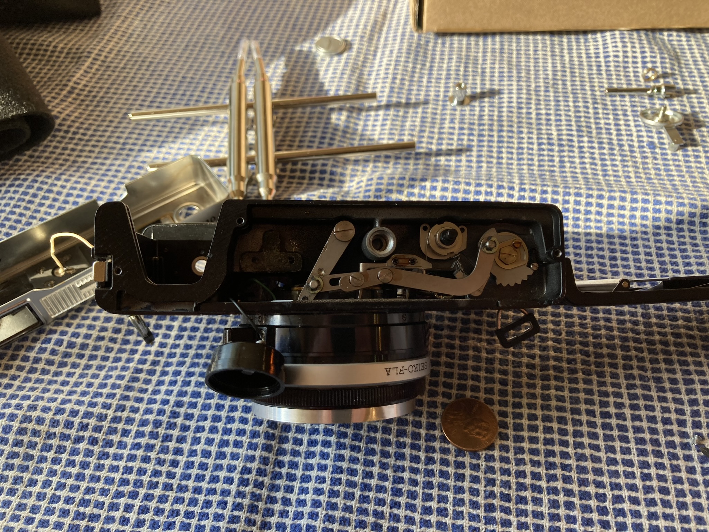
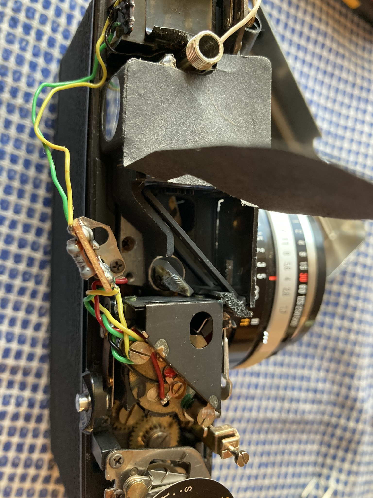
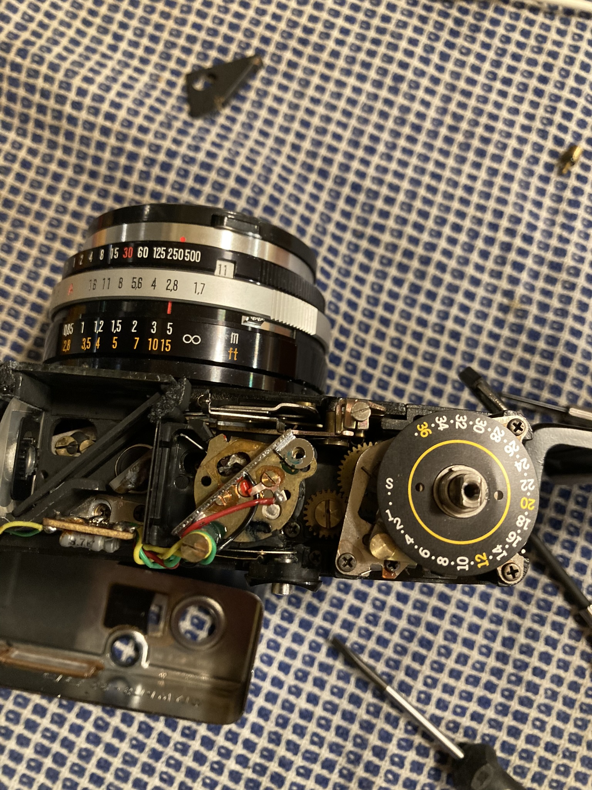
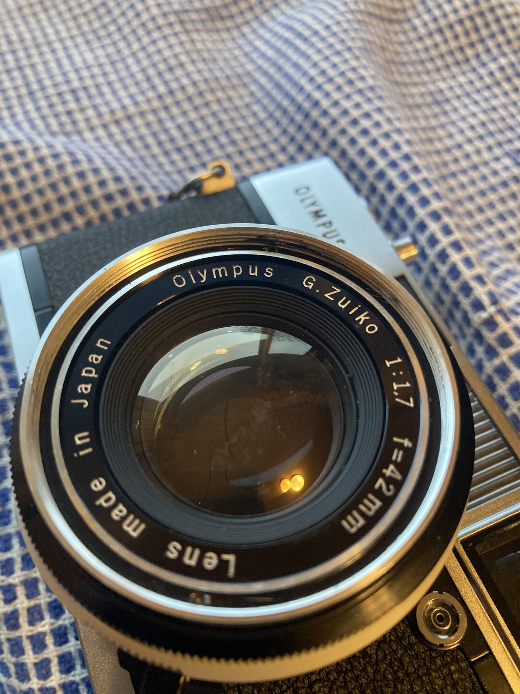
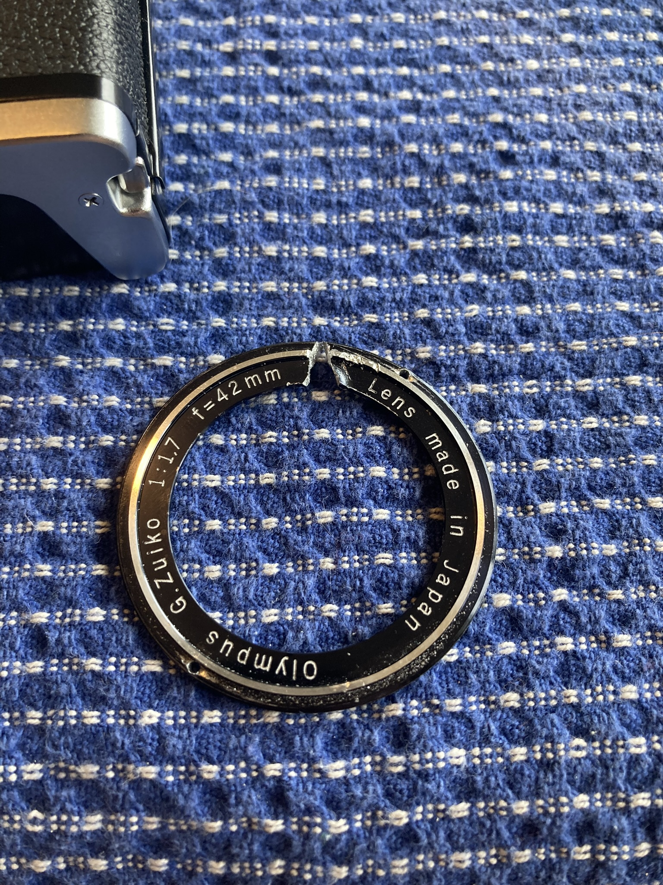
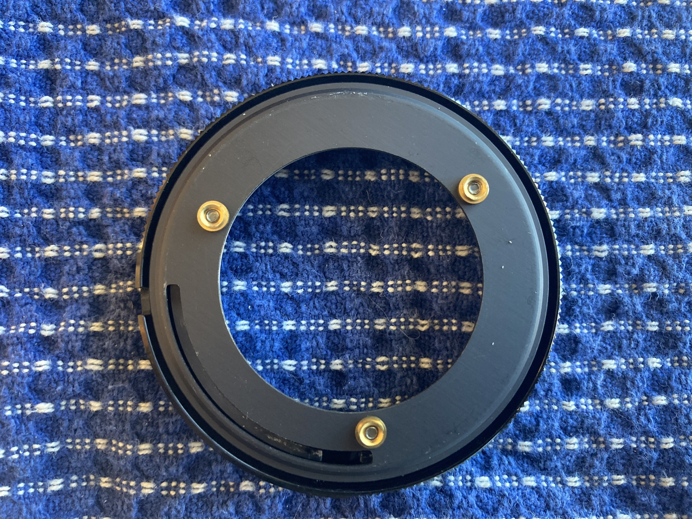
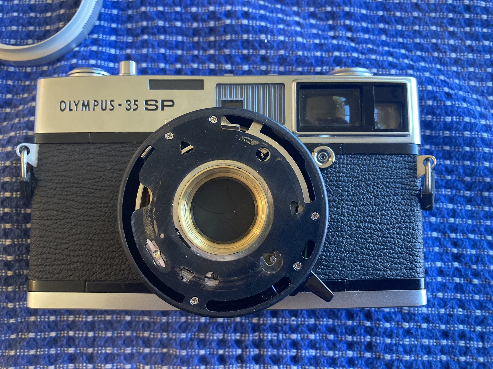

I recently picked up an Olympus 35-SP for a good price on eBay, knowing that it had a busted meter and some dust on the inside of the lens. I'd been repairing some Olympus vintage lenses for my Pen-F and was feeling capable. However this is not a story of success but a story of failure.

The Camera other than the known flaws was in very good condition. The big things worked, all the controls moved smoothly, the apertures all worked, the shutter moved cleanly, focus was set correctly, etc.

I built a little system for measuring shutter speeds. It's pretty simple, a laser, a photo diode, and a little samd21 microcontroller that measures the time between when it sees the laser and when it goes away. Using this system this camera had very accurate shutter speeds on top of it all.

## The Meter

The first thing I worked on was the meter. The most common kind of issues with these camera meters is just simple electrical faults. It's really common for corrosion around the battery terminal to cause power failures so I started by opening up the bottom.

The wire connecting to the battery terminal had failed and come lose, so I soldered in some more wire to give myself some room, and soldered it back into the battery terminal.

The next most common issue is that the CdS cell fails. To check that I opened up the top of the camera. The meter in this camera sits behind a little iris on the left of the camera. (the iris is controlled by a little ISO dial and adjusts the amount of light the meter receives to accommodate the film speed.

(It's a bit hard to see here but the actual photocell is located at the very top of this image with the three wires coming off).

Once I'd made sure that the cell was getting the correct 1.35v from the battery I wanted to check that the cell itself was working. The 35-SP is unique for this era of cameras because it contains two metering zones, an center averaged zone and a spot zone. The Cell thus has one wire for each of the zones. While I don't have the tools to measure the accuracy of the meter, I could see that as I brought a light up to the meter and turned it away I saw a voltage swing from about 1v to 250mv which to me indicates that the cell is at least doing something.

So then there's the last part of the meter, the galvanometer, which is the electrical component that moves the meters needle in response to the change in voltage.

The galvanometer is the brass piece you can see here with the three wires leading to it. You can barely make out the needle stuck to the far left.

To test the galvanometer I took it out of the camera and desoldered it. A galvanometer works by running a little current through a winding, the needle sits in the winding and is moved by the generated magnetic field. When testing it you should get a low resistence, just the resistence of the windings, but when I tested mine out of circuit it tested open.

Looking at it, there are little springs that connect from the housing to the windings, both the top and the bottom springs had come desoldered on mine. But even after repair the meter tested open. Sometimes, poking around enough it would work, but never reliably.

Setting the meter aside for a minute I decided to look into the dust in the lens.

## The Lens

The lens on this camera is a famously sharp 40mm f1.7. I knew that to get to the back of the front element I needed to open up the front of the lens. The first piece is a small little alluminum ring called the "name ring" or the "brand ring", it has the manufacturers brand and the lens info. For some 35-SPs this is just glued in, but mine is one of the less common threaded in kind.

I've removed these a good handful of times and so set to it without thinking too much about it. However while the lens got moving okay, after a few turns it got well and truly stuck. Looking back at this image today I can see that the threads aren't clean, and this is something I'm unlikely to ever forget. No ammount of trying could get it unjammed. I tried everything, I couldn't reverse it back, I cleaned it with IPA, I oiled the threads, I pushed and pulled, and eventually I give it one big go and heard a series of pops and knew that I'd finally broken something.

My best hypothesis was that I'd broken the three screws that I knew sat just below the name ring on the lens assembly. This felt BAD. After all, I'd started with a working camera. The unspoken rule of folks repairing these old things is first do no harm and I broke that rule. I set that camera down and walked away.

## Coming back

Okay so the name ring was jammed, and the camera was broken. I wouldn't be able to get it repaired for a worthwhile amount of money, so I might as well keep trying. So I decided to cut the name ring off. I dremeled a good bit and then used some tiny hand files to cut through the rest of the way. When I finally got to the threads, I took some needle nose pliers and twisted a little and the ring popped out, and along with it a long string of thread that it had been jammed on.

With the name ring out I could finally see what damage I'd done! Disassembling the rest of the lens went pretty smoothly. First the front lens assembly comes out, a lens spanner does the trick. Then there are three screws that hold the lens controls in (warning they're glued in, little acetone goes a long way).

Normally, all of the control rings are mounted up to three little brass fittings attached to the shutter assembly. But mine just came free as soon as I got the lens out.

The three brass rings here were supposed to be attached to this plate here:

This is what I broke. I had pulled those three brass fittings out. At first I thought these fittings were sort of riveted in, where the back flange would be bent over to hold it to the body. But looking closer the kind of trefoil shape on the plate reminded me a lot of pressure release cut outs and I think they were just pressed in. The brass fittings themselves had inherited the shape of the cut out. By lining them up right, and a little muscle I pressed them back in without much trouble (and added a little epoxy to the backs of each to hopefully keep them in place).

## Wrapping things up

Well with the fittings replaced I could re-assemble the lens and getting things back together. I took a brief moment to clean up the lens.

So what's the score? I got a clean lens, and in return... I ruined a name ring and managed to leave a couple small scratches on the lens. Ultimately this was just a bunch of fail.

I think there's two big lessons for me here.

1. In the future I will spend a lot more time looking at filter threads. Maybe I'll look for a lens wrench that can recut them. If I'd cleaned out those threads I don't think anything would have gone wrong.
2. Cutting the ring off was way less damage than using force. I could probably get a new ring off a donor for not very much money. Way better than breaking a camera.

In the end, I'm bummed that I did damage but I'm glad I learned some things. The name ring isn't functional in any way, and maybe I'll get cute and put in a 3D printed version. I think this camera is fully functional now, so I plan to put some film in it and take some pictures!
